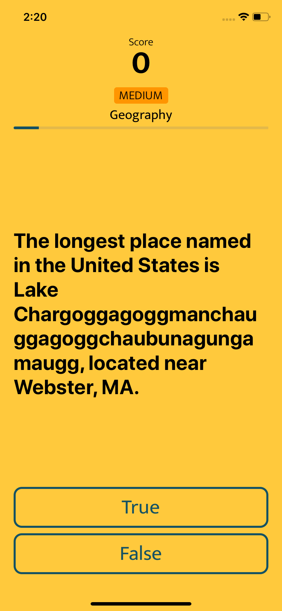
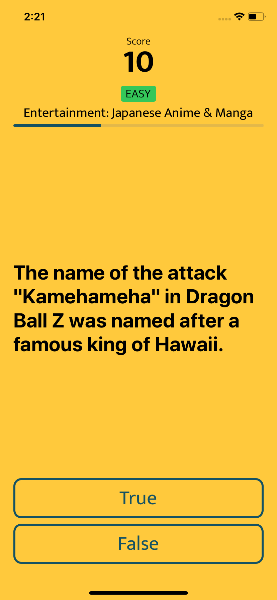

# QUIZZES
This is app as a result of my NC3 Challenge at Apple Developer Academy @IL where i explore and implementing VIPER Design Pattern to a simple project called Quizzes.

## Screenshot

  
  

## Overview & Story Behind
Design Pattern is one of thing that should be taken seriously when you developed an app with scale, this is what keep you stay align so your code can't get too mess when you gone far. Since i learn about swift, this is what i've been dealing with because when i code, i often take part to write main logic that take hours to debugging and my code has been really bad since then. So i started to learn basic about design pattern especially in swift. I tried pattern like MVC and MVP before i exposed with this amazing pattern called VIPER that (as far as i know) only exist in iOS environment.

## VIPER
Let's talk briefly about VIPER. This is realisation of clean architecture for iOS-built application that often used to make scalable app because its separated particular tasks to each element so its make it easier for developers to maintain project for future update and testing too. As a common rule for the pattern names, it is backronym as well, for View, Interactor, Presenter, Entity, and Router. Let me explain briefly each part based on what i've learned:

#### View
This is where elements mirrorring user action, get user input and return output to then be displayed on the interface. This part can only interact directly with Presenter

#### Interactor
This is where all business logic is happening, and also API Calling, communication with entity, and return the data to the presenter

#### Presenter
This is a bridge between all the elements on the system such as retrieve input from view, transferred the data to interactor and get processed data to then be displayed to the View, its also bridging router to opening exact screen from.

#### Entity
This is simply where data model created to then be reference for interactor and help them with in the process

#### Router
This elements responsible for navigation all views, such as push, pull, present controller and other things. Its sometimes referred as Wireframe

## Data Sources
For the quizzes data in this project, i use free public api from https://opentdb.com. This is public api where you can use and customize quizzes data base on what you need, and also you can contribute to add more quiz to the database. For more information, just click link above and you can start right away.

## Contribution
This is an ongoing project that might help you (and also me) to learn about VIPER design pattern, so if you think you can make this project even better by adding more feature or maybe remove what is not so important, just make pull request at this repo and let's get crazy together! 🤟🤟
